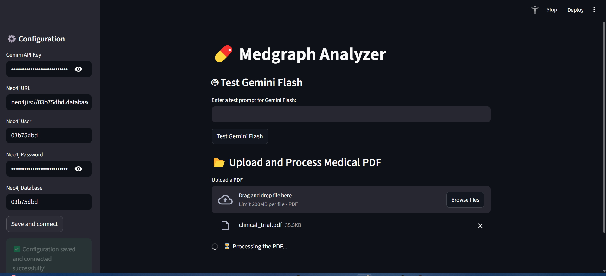
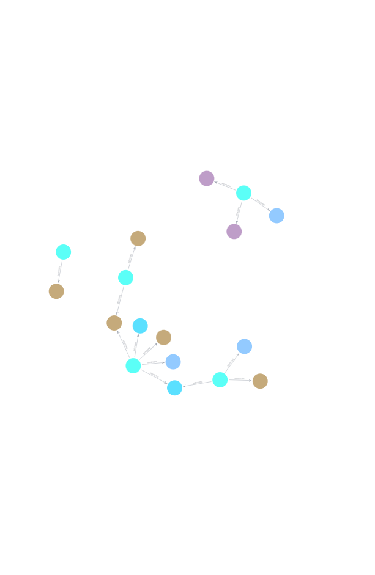

# 💊 Medgraph Analyzer

**Medgraph Analyzer** is an interactive Streamlit application that processes **medical PDFs** into a **Neo4j knowledge graph**. It leverages **Google Gemini LLMs** for natural language understanding and embeddings, and supports **graph-based Q&A** over extracted medical entities, relationships, and context.

---

## 🚀 Features

- 📂 **Upload Medical PDFs** → automatically extract structured entities and relationships (e.g., Patients, Diseases, Medications, Symptoms, Tests, Doctors).  
- 🧠 **Graph Construction** → build a Neo4j knowledge graph with medical nodes and relationships.  
- 🔎 **Hybrid Search** → use embeddings + keyword indexing for powerful semantic retrieval.  
- 🤖 **LLM Integration** → Google Gemini Flash for reasoning + embedding generation.  
- 💬 **Q&A Interface** → ask natural language questions, get Cypher queries + graph-backed answers.  
- 🖥️ **Streamlit Frontend** → intuitive UI for configuration, testing, and PDF uploads.

---

## 📸 Example Outputs

### 1. Frontend UI


### 2. Extracted Knowledge Graph (visual structure)


### 3. Graph Table View


### 4. Clinical Trial Report (PDF)
[📄 Open Clinical Trial Report](clinical_data/clinical_trial.pdf)

---

## 📦 Tech Stack

- [Streamlit](https://streamlit.io/) – frontend UI  
- [Neo4j Aura](https://neo4j.com/cloud/aura/) – graph database  
- [LangChain](https://www.langchain.com/) – LLM integration & graph utilities  
- [langchain-neo4j](https://github.com/langchain-ai/langchain-neo4j) – modern Neo4j connector  
- [Google Generative AI](https://ai.google.dev/) – Gemini Flash for chat + embeddings  
- [PyPDFLoader](https://python.langchain.com/docs/integrations/document_loaders/pdf) – extract text from PDFs  

---

## ⚙️ Installation

### 1. Clone the Repository
```bash
git clone https://github.com/your-username/medgraph-analyzer.git
cd medgraph-analyzer
```

### 2. Create a Virtual Environment
Using `uv` (recommended):
```bash
uv venv .venv
uv pip install -r requirements.txt
```

Or with pip:
```bash
python -m venv .venv
.\.venv\Scripts\activate
pip install -r requirements.txt
```

### 3. Set Up Environment Variables

Create a `.env` file in the project root:

```env
# Google Gemini API Key
GEMINI_API_KEY=your-gemini-api-key

# Neo4j Aura credentials
NEO4J_URI=neo4j+s://<your-database-id>.databases.neo4j.io
NEO4J_USERNAME=neo4j
NEO4J_PASSWORD=your-password
NEO4J_DATABASE=<your-database-id>
```

⚠️ **Important:**  
- `NEO4J_USERNAME` should always be `neo4j` for Aura.  
- `NEO4J_DATABASE` is the unique database ID (e.g., `03b75dbd`).  

### 4. Run the App
```bash
uv run streamlit run app.py
```

Then open:  
👉 [http://localhost:8501](http://localhost:8501)

---

## 🖱️ Usage

1. **Configure API & Neo4j** in the sidebar.  
2. **Test Gemini Flash** with a sample prompt.  
3. **Upload a PDF** – content is parsed, split, and stored in Neo4j with embeddings.  
4. **Ask Questions** in the Q&A interface – queries are translated into Cypher and executed against the graph.  

---

## 📂 Project Structure

```
medgraph-analyzer/
│
├── app.py               # Streamlit entrypoint
├── pdf_processor.py     # PDF → Graph processing pipeline
├── requirements.txt     # Dependencies
├── .env.example         # Example environment variables
├── clinical_data/       # Example inputs & outputs
│   ├── clinical_trial.docx
│   ├── clinical_trial.pdf
│   ├── frontend.png
│   ├── graph db taable.png
│   ├── visualisation.png
└── README.md            # Project documentation
```

---

## ✅ Roadmap / Next Steps

- 🔐 Add authentication for secure API usage  
- 🏥 Expand medical ontology (e.g., procedures, lab results)  
- 📊 Add graph visualizations in the UI  
- 📈 Integrate analytics dashboards (Streamlit or NeoDash)  

---

## 🤝 Contributing

Pull requests and issues are welcome! Please fork the repo and submit a PR with your improvements.

---

## 📜 License

MIT License – feel free to use and adapt.
